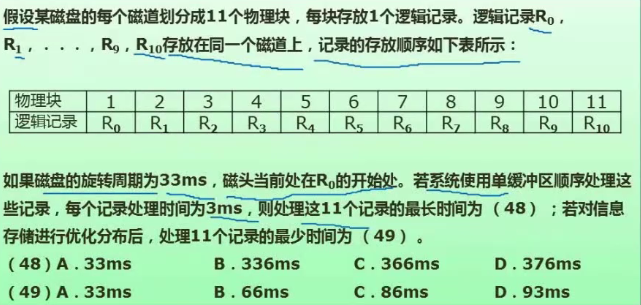
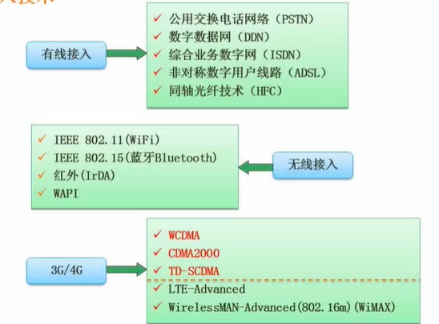
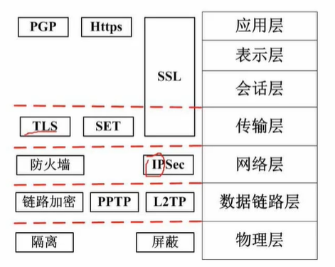
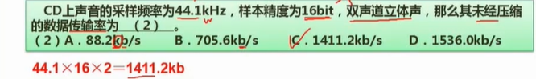
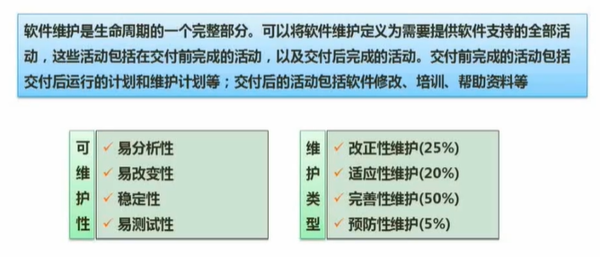
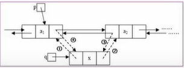
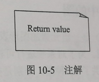
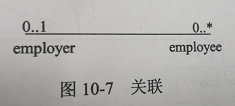
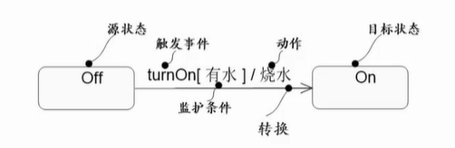

# 计组

- **数据进制的转换**

> 1. X进制 转 十进制
>
> 方法: 按权展开
>
> 如: 
>
> ---
>
> 2. 十进制 转 X进制
>
> 方法: 十进制数除以相应X,取余数,余数构成的集合从右向左排列即对应X进制数
>
> 如: 
>
> ---
>
> 3. 二进制转八进制 或 八进制转二进制
>
> 方法: 三位二进制数对应一位八进制数  或 一位八进制数对应三位二进制数【不足三位的则前面补0】
>
> 如: 
>
> ---
>
> 4. 二进制转十六进制 或 十六进制转二进制
>
> 方法: 四位二进制数对应一位十六进制数 或 一位十六进制数对应四位二进制数【不足四位的则前面补0】
>
> 如: 

- **原码反码补码移码**

> > 原码,反码,补码中的符号位: 0代表正数,1代表负数。
> >
> > 注: ***真值即除了符号位剩下的那部分位。那部分才需要变化。且转换成十进制也只需转换到真值部分即可,符号位不参与***
> >
> > ---
> >
> > 原码: 有符号位,真值不变。【数值0有两种表示】
> >
> > 反码: 有符号位,正数真值不变,负数真值取反。【数值0有两种表示】
> >
> > 补码: 有符号位,正数真值不变,负数真值取反加1.【数值0只有一种表示】
> >
> > 移码: 不管正负数，只要将其补码的符号位取反即可。
> >
> > ---
> >
> > 数值表示范围:
> >
> > 
> >
> > 发现: <u>*补码比原码和反码的表示范围多一个数*。</u>
> >
> > 原因: ***补码对数值0只有一种表示,相比原码和反码多了一个数的表示空间。***
> >
> > 各种8位二进制的表示法的数据范围如下：
> >
> > 原码：-127 ~ 127；
> >
> > 反码：-127 ~ 127；
> >
> > 补码：-128 ~ 127其中***-128的补码为10000000是人为规定。***
> >
> > ---
> >
> > - 原码的运算: 原码的加减法运算较复杂。
> >   - 原码运算时,符号位不参加运算。其它编码符号位都是参与运算的。
> >   - 当两数相加时,首先需要判断两数的符号是否相同,如果相同则两数相加
> >   - 若符号不同,则两数相减。
> > - 反码的运算: 
> >   - 反码运算时,其符号位与数值一起参加运算。
> >   - 反码的符号位相加后,如果有进位出现,则要把它送回到最低位去相加(循环进位)
> >   - 用反码运算,其运算结果亦为反码。在转换为真值时,若符号位为0,结果不变；若符号位为1,应将结果按位取反才是其真值。
> > - 补码的运算:
> >   - 补码运算时,其符号位与数值部分一起参加运算。
> >   - 补码的符号位相加后,如果有进位出现,要把这个进位舍去(自然丢失)
> >   - 用补码运算,其运算结果亦为补码。在转换为真值时,若符号位为0,结果不变；若符号位为1,应将结果按位取反再加1才是其真值。
> > - 进行定点数加减运算时,绝对值若变大,则可能溢出,反之,则不会溢出。

- **浮点数运算**

> 浮点数的表示:  **M×2<sup>E</sup>   **
>
> **其中:  M是尾数，E是阶码**   **2是基数** 【**尾数和阶码常用补码表示**】
>
> ---
>
> 运算步骤:
>
> 1. 对阶(原则:小阶对大阶,尾数左移扩大(右移缩小),对应阶码缩小(扩大)
> 2. 尾数计算
> 3. 结果格式化
>    1. (确保尾数第一个位置,即小数点左边这个位置不能是0)
>    2. (确保尾数第一个位置,即小数点左边这个位置的数字位数只能是1位)

- **运算器与控制器组成**


- **数据传输控制方式**(略)

1. 程序控制方式(程序查询方式)

2. 程序中断方式。(***中断响应时间: 发出中断请求到开始进入中断服务程序所需的时间***)

3. DMA(Direct Memory Access)方式

   > 采用DMA传送数据时,每传送一个数据都需要占用一个(**存储周期)**
   >
   > DMA是直接内存存取,传送数据的时间只与内存相关,与CPU的时间无关。

4. 通道。

5. 输入输出处理机。

- Spooling技术


> 注：
>
> Spooling技术本质: 磁盘开辟缓冲区,形成输入输出队列,
>
> 利用缓冲区协调输入低速处理高速的问题。

- **计算机体系结构分类(Flynn分类法)**

分类指标: 指令流和数据流


- **CISC指令集与RISC指令集**


- **流水线的计算问题**：

> 流水线的建立: 即第一条指令运行成功。时间为各个阶段的时间之和,即:   (t1+t2+...+tk)
>
> 当流水线建立后,其后的每个指令只需要一个周期即可完成。
>
> 设一次需要执行的指令数目为: n
>
> 流水线的一个周期△t为:  <u>各个阶段执行时间最长的那段的时间</u>
>
> ---
>
> 流水线的计算公式**(考试先以理论公式去计算,没有答案再以实践公式计算):**
>
> - 理论公式: (t1+t2+...+tk)+(n-1)*△t
> - 实践公式: 
>   - 本质：将第一条指令的运行的各阶段(设为k个阶段)时间也等同于一个周期去计算。
>   - 公式:   k*△t+(n-1)*△t = (k+n-1)*△t

例题:


```
1. 其流水线的一个周期为:2ns
2. 理论时间: (2+2+1)+(100-1)*2 = 203ns
3. 实践实践: (3+100-1)*2 = 204ns
```

- **流水线吞吐率的计算:**

> 流水线的吞吐率: 即: 单位时间里执行的指令数目
>
> 公式为: 执行的指令条数/流水线的执行时间
>
> ---
>
> 流水线的最大吞吐率:
>
> 公式: 1/ △t   其中△t为流水线的一个周期

以上面的例题为例:

```
其吞吐率为: 100/203
```

- **流水线加速比计算**

> 流水线的加速比: 
>
> - 即: 执行同样数量的指令,不使用流水线所需要的时间与使用流水线所需要的时间的比值。
> - 公式: (不使用流水线的执行时间)/(使用流水线的执行时间)

以上面的例题为例:

```
不使用流水线的执行时间:(2+2+1)*100=500
使用流水线执行的理论时间: 203
故加速比: 500/203  故加速比越大越好,体现流水线的效率之高
```

- **流水线的效率**

> 公式: n个任务占用的时空区/总的时空区

例题:


```
图中每个小空格代表一个时空区
其流水线效率为:(△t+△t+△t+3△t)/(15*4*△t)
```

- **寻址方式总结:**

> 立即寻址: 操作数直接出现在指令中。
>
> 寄存器寻址: 操作数在寄存器中。
>
> 直接寻址: 有效地址直接在指令中给出，CPU按照有效地址去存储器找操作数.
>
> 寄存器间接寻址: 有效地址在寄存器中。
>
> 基址寻址:有效地址**同时由**基址寄存器和位移量表示.
>
> 变址寻址:有效地址**同时由**变址寄存器和位移量表示.

- **存储系统**

> 速度: 寄存器>Cache(按内容存取)>主存>辅存
>
> 容量:寄存器<Cache(按内容存取)<主存<辅存

- **主存**

> 主存的组成: 存储体, 控制线路,地址寄存器,数据寄存器和地址译码电路等五个部分组成
>
> 主存主要采用动态随机存储器DRAM
>
> Cache采用静态随机存储器SRAM
>
> EEPROM是电擦除可编程的只读存储器
>
> ---
>
> 主存按其存取方式的分类:
>
> - RAM(Random Access Memory)随机存取存储器: 内容断电后都会消失,每次开机内容随机,不固定
>   - DRAM(Dynamic RAM 动态RAM): 隔一段时间要刷新充电一次,否则数据会消失
>   - SRAM(Static RAM 静态RAM)(速度更快):只要保持通电,数据就可以保持。
>   - CMOS(Complementary Metal Oxide Semiconductor):是计算机主板上的一块可读写的RAM芯片,用来保存BIOS设置完计算机硬件参数后的数据,这个芯片仅用来存放数据。
> - ROM(Read Only Memory)只读存储器: 内容断电后都不会消失
>   - 如PROM,EPROM,**Flash Memory(非易失存储器,以块为传送单位)**
>   - BIOS一般存储在ROM中。
> - 相联存储器: 是一种按内容访问的存储器。
>
> ---
>
> 主存的编址:
>
> 如: 8*4的存储器
>
> 其中: 由于CPU是按存储单元访问的,故8代表存储器有8个存储单元,4代表每个存储单元由4个bit位组成。

- **高速缓存(Cache)**

> 高速缓存的组成: 
>
>   1.控制部分: 用来判断CPU要访问的信息是否在Cache存储池器中。
>
>   2.存储器部分: 用来存放主存的部分拷贝信息。
>
> ---
>
> 高速缓存的地址映像:
>
> ​	为什么需要地址映像: CPU工作时,送的是主存单元地址,但实际要从Cache中读写信息。
>
> ---
>
> 高速缓存的地址映像的方式:
>
> 1. 直接映像: 主存中的块只能存放在Cache存储器的相同块号中。
>
> 2. 全相联映像: 主存的任一块可以调入Cache存储器的任何一个块空间中。
>
> 3. 组相联映像: 
>
>    折中方案,将Cache中的块分成组,主存则按Cache的大小进行分区再在区里面进行分  组, 组采用直接直接映射方式,组中的块采用全相联映像方式。

- **Cache+主存的系统平均读取周期计算**

> 如果以h代表对Cache的访问命中率, t1代表Cache的周期时间, t2代表主存储器周期时间,则使用"Cache+主存"的系统的平均周期时间为t3,则:
>
> **<u>t3 = h * t1 + (1-h) * t2</u>**  
>
> 其中:(1-h)又称为失败率,即未命中率

- **磁盘**

>磁盘存取时间 = 寻道时间+等待时间
>
>寻道时间: 指磁头移动到磁道所需的时间
>
>等待时间: 等待读写的扇区转到磁头下方所用的时间

- **总线系统**

> 按照总线所处的位置的一般分类:
>
> 1. 内部总线(如:芯片内部的总线)
>
> 2. 系统总线(如:ISA,EISA,PCI)(计算机各组成部分的连接)
>    1. 数据总线
>       2. 计算机的字长取决于数据总线的宽度。如:64位的CPU指CPU的数据总线宽度是64位。
>    2. 地址总线
>       1. 每条地址线一次只能传输1位二进制数据。                
>       2. CPU是通过地址总线来指定存储单元的,其决定了CPU所能访问的最大内存空间的大小。
>       3. 如: 计算机的地址总线的宽度是32位,即2<sup>32</sup>=4G内存,则最多允许直接访问4GB物理空间。
>    3. 控制总线
>       1. 控制总线负责对外部器件进行控制,其宽度决定了CPU对外部器件的控制能力
>
> 3. 外部总线(连接外部设备的总线)
>
>    如:【RS-232C, SCSI总线(小型计算机系统接口),USB,IEEE-XX相关总线】

- **运算器和控制器的组成**

> 运算器:
>
> 1. 算术逻辑单元ALU
> 2. 累加寄存器
> 3. 数据缓冲寄存器
> 4. 状态条件寄存器
>
> ---
>
> 控制器:
>
> 1. 程序计数器PC: 用来存放将要执行的下一条指令的地址
> 2. 指令寄存器IR: 存放即将执行的指令
> 3. 指令译码器: 对指令中的操作码字段进行分析和解释。
> 4. 时序部件
>
> CPU执行指令的过程,会根据时序部件发出的时钟信号进行操作.在取指令阶段读取的是指令,在分析和执行指令时,如果需要操作数,则读取操作数。【即根据指令周期的不同阶段来区分指令和数据】

- **系统可靠性**

> 串联部件的可靠度=各部件的可靠度的乘积
>
> 并联部件的可靠度=1-（部件失效率的乘积）

*例题:*


```
每个部件的可靠度都为R,则该系统的可靠度为:
	由于图是 "先并后串"
	1.先求出三个R并联的可靠度为:1-(1-R)^3
	2.然后求出两个R并联的可靠度:1-(1-r)^2
	3.最后整个系统的可靠度是串联的,即两者之积:
		即:1-(1-R)^3 * 1-(1-r)^2
```

- **校验码**

> 码距: 编码系统中任意两个合法码之间的最小距离(二进制位数)
>
> ---
>
> 在一个码组内为了检测e个误码,要求最小码距d应满足: d>=e+1
>
> 在一个码组内为了纠正t个误码,要求最小码距d应满足: d>=2t+1
>
> ---
>
> 奇偶校验码:可以检错不能纠错的编码。
>
> CRC码:可以检错不能纠错的编码。
>
> - 核心: 模2除法
> - 校验位添加在数据位的尾部。
>
> 海明码:**可以检错也可以纠错的编码。**(***海明码利用奇偶性进行检错和纠错***)
>
> - 每个数据位由确定位置关系的校验位来校验。
>
> - > 1. 根据公式确定校验码位数和位置
>   > 2. 信息的Bit位从右到左分别为I1=1,I2=1,I3=0,I4=1,将信息的Bit位从右向左填满表格
>   > 3. 将信息位对应的位序号拆解成2的次方数相加的形式
>   > 4. 2的次方数的指数代表了"r几"这个校验位。
>   > 5. "r几"这个校验位在哪个信息位对应的位序号出现过就代表有其I值，互相做异或运算。
>
> - 

# 操作系统

## 进程管理(处理机管理)

- 进程的状态及状态转换


```
1.活跃就绪:指进程在主存并且可被调度的状态。
2.静止就绪:指就绪进程被对换到辅存时的状态,它不能被直接调度的状态,只有当主存中没有活跃就绪进程,或者是挂起态进程具有更高的优先级,系统将把挂起进程调回主存并转换为活跃就绪。
3.活跃阻塞:指进程在主存,一旦等待的事件产生便进入活跃就绪状态。
4.静止阻塞:指阻塞进程被对换到辅存时的状态,一旦等待的时间发生便进入静止就绪状态。
```

- 前趋图: 表现活动之间的时间关系和并行关系。

- 进程的同步与互斥:
  - 互斥: 资源只允许一个进程使用。即: 千军万马过独木桥。
  
  - 同步: 进程之间速度有差异,在一定情况下停下等待。即: 有速度同步匹配要求。
  
  - ```
    临界资源(Critical Resource,CR):一次只能供一个进程使用的资源。
    临界区:(Critical Section,CS):进程中对临界资源实施操作的那段程序。
    
    对临界区管理的4个原则:
    1.有空即进。
    2.无空等待。
    3.有限等待。
    4.让权等待。
    ```
  
- PV操作及PV操作与前趋图的结合。

  - PV操作属于低级线程通信方式。
  - 高级线程通信方式有:
    1. 共享存储区模式。
    2. 消息传递模式。
    3. 管道通信。

- 进程调度

  - ```
    进程调度方式分为: 可剥夺式和不可剥夺式调度。
    ```

  - 三级调度

  > 高级调度(作业调度): 决定磁盘中哪个后备作业进入主存成为就绪进程。
  >
  > 中级调度(对换调度): 使处于内存的进程和处于盘交换区的进程交换位置。
  >
  > 低级调度(进程调度): 决定内存中哪个就绪进程可以占用CPU。

- 死锁问题。
  -  **最少能避免死锁的资源数量**,要从**确保让一个进程能运行的角度去考虑**。
  - 故最少资源数为: **k*(n-1)+1**
  - 其中: k代表进程的数目,n代表每个进程需要的资源数目。
  
- 银行家算法(死锁的避免)

## 作业管理

> 包括任务,界面管理,人机交互,图形界面,语音控制和虚拟现实等。

......

## 存储管理

1. **分区内存分配管理**

> 即: (将主存的用户区划分出若干区域,每个区域分配给一个用户作业使用)
>
> ---
>
> 按划分方式不同,分为:
>
> 固定分区:静态分区,系统生成时已将主存划分为若干个分区,每个分区的大小不等。
>
> 可变分区:动态分区,存储空间的划分是在作业装入时进行,分区的个数是可变的。
>
> 可重定位分区:解决碎片问题需要进行分区靠拢,故有地址重定位问题。
>
> ---
>
> 可变分区的请求和释放分区主要有以下4种算法:
>
> 首次适应法: 根据内存地址从小到达排序各个内存分区, 优先分配内存地址小的分区。
>
> 最佳适应法: 根据内存分区的大小从小到大排序,优先分配大小最适合的分区。
>
> 最差适应法:根据内存分区的大小从小到大排序,优先分配最大的分区。
>
> 循环首次适应法: 将所有空闲分区连接成一个环状,每次分配都从刚刚分配过的空白区开始寻找,然后下次就从链接着的下一个空闲分区开始分配。

- 分页式存储管理**(略)**

- 分段式存储管理**(略)**

- 段页式存储管理**(略)**

- 虚拟存储管理**(略)**

  - 请求分页系统。

  - 请求分段系统。

  - 请求段页式系统。

  - 页面置换算法

    - 最佳(Optimal)置换算法。
    - FIFO置换算法。
    - LRU置换算法。

  - > 工作集: 某段时间间隔里进程实际要访问的页面的集合。

---

2. **磁盘管理**

> 在Windows系统中的磁盘碎片整理程序可以分析本地卷，使每个文件或文件夹占用卷上连续的磁盘空间，合并卷上的可用空间使其成为连续的空闲区域，这样系统就可以更有效地访问文件或文件夹，以及更有效地保存新的文件和文件夹。通过合并文件和文件夹，磁盘碎片整理程序还将合并卷上的可用空间，以减少新文件出现碎片的可能性。
>
> ***合并文件和文件夹碎片的过程称为碎片整理。***

## 文件管理

- **文件的结构和组织**

文件的逻辑结构:

> 1. 有结构的记录式文件,由一个以上的记录构成的文件。
> 2. 无结构的流式文件，由一串顺序字符流构成的文件。

文件的物理结构:

> 1.连续结构
>
> 2.链接结构
>
> 3.索引结构
>
> 4.多个物理块的索引表

- **文件存储空间的管理**

> 1.空闲区表。
>
> 2.位示图。
>
> 3.空闲块链。
>
> 4.成组链接法。

- **索引文件结构**


> **直接索引**: 索引结点的值直接对应物理盘块号
>
> **一级间接索引**: 索引结点的值存储一级索引表,一级索引表的值对应物理盘块号
>
> **二级间接索引**: 索引结点的值存储一级索引表,一级索引表的值存储二级索引表,二级索引表的值对应物理盘块号,**以此类推....**
>
> **一个索引表对应存储在一个物理块中**,而**不是由地址项拆分出来。**

*例题:* 


```
由于逻辑快号一般是从0开始算的,故逻辑块号0对应addr[0],逻辑块号1对应addr[1],逻辑块号2对应addr[2],逻辑块号3对应addr[3],逻辑块号4对应addr[4]；
但是由于addr[5]结点是一级间接索引,其存储的值是一级索引表,一级索引表的值才是对应的物理块号。故逻辑块号5对应addr[5]中的一级索引表中的第一个值即对应58物理块号。

由于磁盘块的大小为1kB,而索引表中的地址项为4B，故一级索引表中的地址项数目为1024/4=256,
且由于第一个一级索引表的起始逻辑块为5,261-5=256，刚好占满第一个索引表,故逻辑块号261对应第二个一级索引表的第一项,即对应物理块号187.

而101号物理块对应addr[7]属于二级索引表,故101号物理块存储的是二级地址索引表。
```

- **文件的绝对路径和相对路径**

> 绝对路径: 是从盘符开始的路径,如Linux中 "/" 
>
> 相对路径: 是从当前路径开始的路径
>
> ---
>
> 例: 
>
> 则文件F2的绝对路径为: /D1/W2/F2
>
> 若当前路径为D1, 则文件F2的相对路径为: W2/F2

- **空闲存储空间管理之位示图法**


> 位示图中的空格代表一个个存储物理块，且1代表物理块的空间已被占用,0则未被占用。

*例题:* 


> 注:
>
> 1. 注意物理块编号是从0开始编号,故4095号物理块是第4096个物理块
>
> 2. 注意第一问中的第几个字中的字是从1开始编号的
> 3. 注意第二问中的字内部的位置是从0开始编号的

```
解: 
(1): (4195+1)/32 = 131.125,故对应 第132个字。
(2): 由于131*32 = 4192个物理块,对应0-4191号物理块。
	 故第132物理块的0位置对应4192,1位置对应4193,2位置对应4194
	 3位置对应4195。由于占用了物理块的空间,故将值置为"1"。
```

- **操作系统的微内核**


## 设备管理

> 对硬件设备的管理,包括对IO设备的分配,启动,完成和回收。

- 设备的分类

> 按数据组织单位分类: 块设备(数据块)和字符设备。
>
> 按资源分配角度分类: 独占设备,共享设备,虚拟设备。
>
> 按数据传输速率分类:低速设备,中速设备,高速设备。

- IO系统的层次结构与每层功能


- 设备管理采用的相关技术

> 1. 通道技术
> 2. DMA技术
> 3. 缓存技术(硬件缓冲/软件缓冲)
> 4. Spooling技术

- 磁盘调度

> 系统在每一时刻只允许一个进程启动磁盘进行IO操作,其余的进程只能等待。
>
> 磁盘调度目标: 采用适当的调度算法,使各进程对磁盘的平均访问时间最小。
>
> ​						即磁盘的平均寻道时间最小。
>
> 磁盘存取时间 = 寻道时间+等待时间
>
> 寻道时间: 指磁头移动到磁道所需的时间
>
> 等待时间: 等待读写的扇区转到磁头下方所用的时间
>
> ---
>
> 移臂调度是指在满足一个磁盘请求时，总是选取与当前移动臂前进方向上最近的那个请求，使移臂距离最短。
>
> 旋转调度是指在满足一个磁盘请求时，总是选取与当前读写头旋转方向上最近的那个请求，是旋转圈数最少。
>
> 且<u>***应先移臂调度,再旋转调度。***</u>
>
> ---
>
> 磁盘移臂调度算法:
>
> 1. 先来先服务算法(FCFS)
> 2. 最短寻道时间优先(Shortest Seek Time First,SSTF): 优先选择这样的进程,其要访问     的磁道与当前磁头所在的磁道距离最近。
> 3. 扫描算法(SCAN)：电梯调度算法。
> 4. 单向扫描调度算法(CSCAN): 规定磁头只做单向移动,单向扫描。
>
> ---
>
> 磁盘旋转调度原则: 
>
> 1. 进程请求访问的是同一磁道上不同编号的扇区。
> 2. 进程请求访问的是不同磁道上不同编号的扇区。
> 3. 进程请求访问的是不同磁道上具有相同编号的扇区。
>
> 对于1和2这两种情况,旋转调度总是让首先到达读/写磁头位置下的扇区先进行传送操作,
>
> 对于3这种情况,旋转调度可以任选一个读/写磁头下的扇区进行传送操作。
>
> 即扇区编号不同,旋转调度总是让首先到达读/写磁头位置下的扇区先进行传送操作【所谓的首先到达读/写磁头位置下,即磁头号相同的】
>
> 扇区编号相同,则旋转调度可以任选一个读/写磁头下的扇区进行传送操作。

***磁盘典型例题示例:***



```
解第一问:
 由于磁盘的旋转周期为33ms,故读取每个物理块的时间为33/11=3ms,与每个记录处理时间相同,
 当磁盘读取第一个R0块放置于单缓冲区用了3ms,并处理这个记录用了3ms,但是此时磁头已到达R2   的开始处。由于题目要求需要顺序处理每个记录,故还要等待磁头旋转到R1的开始处,即需要磁盘旋转一圈加上读取R0的时间才到达R1的开始处,即相当于处理R0这个物理块用的时间为:33+3=36ms,而R0到R9的处理方式都和R1相同;
 对于特殊的R10,由于没有R11,故不需要去旋转一圈之类的动作,直接读取就好。
 
 故处理这11个记录的最长时间为:(33+3)*10+(3+3) = 366ms.
```


```
解第2问:
 如上图所示,优化各个记录的存储位置,没有时间浪费,即顺序处理即可:即(3+3)*11=66ms
```

## 嵌入式操作系统


# 数据库

## 三级模式-两级映射。

> 内模式-模式映射: 保证数据的物理独立性。
>
> 外模式-模式映射: 保证数据的逻辑独立性。

## 数据库设计过程


## E-R模型。

**注**: 

1. 补充题目E-R图时不只要补齐题目要求的联系,根据常识可能存在的联系也要补充。

2. 填写关系模式的属性时,不一定是直接照抄题目所给属性,有时根据意义需要进行替换,

   如: 所属厂商-->替换成厂商ID。

> **局部E-R图集成为全局E-R图, 可能产生的冲突及解决办法:**
>
> 1. 属性冲突: 包括**属性域的冲突和属性取值单位的冲突**
> 2. 命名冲突: 包括**同名异义和异名同义**
> 3. 结构冲突: **常见为一个事物一方面作为属性,一方面作为实体** ;或者 **同一实体在不同局部E-R图中属性的个数或排列不同**。

## 扩充的E-R模型

> 1.***弱实体***：这种实体对另一些实体有很强的依赖关系,即一个实体的存在必须以另一个实体为前提。
>
> ​	弱实体要用双边框矩形进行表示。
> ​	弱实体和依赖实体间的联系要用双边框菱形表示。
>
> ​	弱实体和依赖实体间的关系必定是多对一的联系。
>
> 2.***特殊化***: 一个实体集可以按照某些特征区分为几个子实体。(普遍->特殊)
>
> ​            例:学生实体集可以分为研究生,本科生等子集。
>
> 2.1: 设有实体集E,如果S是E的某些真子集的集合,则称S是E的一个特殊化,
>
> ​           E是S1,S2,...Sn的超类,S1,S2,....Sn称为E的子类。
>
> ​            子类继承超类的所有属性和联系,但是,子类还有自己特殊的属性和联系。
>
> ---
>
> 2.2: **全/部分特殊化**: <u>如果Si的并集等于E,则称S是E的全特殊化,否则是部分特殊化。</u>
>
> 2.3: **不相交/重叠特殊化**: <u>如果Si之间不存在交集,则是不相交特殊化,否则是重叠特殊化。</u>
>
> 3.***普遍化***: 将具有共同特征的实体集概况成一个更普遍的实体集的过程。
>
> ​           例: 将研究生,本科生概况为学生。

***扩充的E-R图相关图示:***

1.  弱实体的图表示: 用双线矩形框表示。

2. 双竖边矩形框表示子类。

3. 超类-子类关系模型使用特殊化圆圈和连线的一般方式来表示,

   超类到圆圈有一条连线.当连线为双线表示全特殊化, 连线为单线表示部分特殊化。

   圆圈中的o表示重叠特殊化,圆圈中的d表示不相交特殊化

   有符号"U"的线表示特殊化。

   

   

## **关系代数运算**

....(略)

## 函数依赖

从已知的一些函数依赖，可以推导出另外一些函数依赖，这就需要一系列推理规则。

这些规则常被称作***“Armstrong 公理”***

> 自反律：若属性集Y包含于属性集X，属性集X包含于U，则X→Y 在R上成立。（此处X→Y是平凡函数依赖）
> 增广律：若X→Y 在R上成立，且属性集Z包含于属性集U，则XZ→YZ 在R上成立。
> 传递律：若X→Y 和 Y→Z在R 上成立，则X→Z 在R 上成立。
>
> 根据上面三条推理规则，又可推出下面三条推理规则：
>
> ④ 合并规则：若X→Y，X→Z，则X→YZ为F所蕴含；
>
> ⑤ 伪传递规则：若X→Y，WY→Z，则XW→Z为F所蕴含；
>
> ⑥ 分解规则：若X→Y，Z⊆Y，则X→Z为F所蕴含。eg: X-->YZ，可分解成: X-->Y,X-->Z

## 关系模式转换

*参考CSDN的 Link*

[二元关系转换](https://blog.csdn.net/weixin_46350177/article/details/114993423)

[三元模式](https://blog.csdn.net/HuaCode/article/details/80042145)

*三元关系转换:*

>1. 若实体间联系是 1：1：1。能够在三个实体类型转换成的三个关系模式中随意一个关系模式的属性中增加另外两个关系模式的键（作为外键）和联系类型的属性。
>2. 若实体间联系是 1：1：N。则在 N 端实体类型转换成的关系模式中增加两个 1 端实体类型的键（作为外键）和联系类型的属性。
>3. 若实体间联系是 1：M：N。则将联系类型也转换成关系模式，其属性为 M 端和 N 端实体类型的键（作为外键）加上联系类型的属性。而键为 M 端和 N 端实体键的组合。【遇到题目加入了m,n,以及1端？？】【有时根据题目和实际写字段】
>4. 若实体间联系是 M：N：P。则将联系类型也转换成关系模式，其属性为三端实体类型的键（作为外键）加上联系类型的属性。而键为三端实体键的组合。

## **规范化理论**和范式

> 非规范化存在的问题: 数据冗余,更新异常,插入异常,删除异常。
>
> ---
>
> 键：
>
> - 超键与候选键:
>   - 相同点: 都可以唯一标识元组。
>   - 不同点: 超键消除了多余的属性后 才称之为候选键。 
> - 候选键与主键: 
>   - 相同点: 都可以唯一标识元组。
>   - 不同点: 候选键可以有多个,主键只能有一个。
> - 外键: 其它关系(表)的主键。

---

**范式**

>1NF：属性值都是不可分的原子值。
>
>---
>
>2NF：消除非主属性对主键的部分函数依赖。
>
>注意:若关系模式的主键是单属性,则必然是2NF,因为部分依赖只会存在于复合属性。
>
>---
>
>3NF：消除非主属性对主键的传递函数依赖。
>
>注意: 若关系模式中的属性都是主属性,由于没有非主属性,故关系模式已达3NF.
>
>---
>
>BCNF: 在3NF的基础上,关系模式的每一个函数依赖的决定元素(即左端的属性)都是关系模式  的候选码。

---

*2NF例题:*

存在关系模式(<u>Sno,Cno</u>,grade,credit),但存在非主属性对主键的部分函数依赖:Cno-->credit:

```
决定元素--->依赖元素(依赖元素 依赖于 决定元素)
需要对部分函数依赖进行分解:
1.部分函数依赖的属性单独拎出来,作为一个新的关系模式
2.原关系模式去除掉 依赖元素所在的列,其它保持不变

故可分解为:(Sno,Cno,grade)和(Cno,credit)
```

---

*3NF例题:*

存在关系模式(<u>学号</u>,所在系,系主任姓名),由于学号-->所在系,所在系-->系主任姓名,所以存在非主属性对主键的传递函数依赖: 学号-->系主任姓名：

```
消除传递依赖分解处理，需要分解到两个关系模式中
1.传递函数依赖的后两个属性单独拎出来,作为一个新的关系模式
2.原关系模式去除掉 依赖元素(即第三个元素)所在的列,其它保持不变
故:原关系模式分解为(学号,所在系)和(所在系,系主任姓名)
```

---

*BCNF例题:*

存在关系模式(S,T,J),且其候选码为ST和SJ,存在函数依赖: SJ--->T,T-->J

```
由于BCNF要求每一个函数依赖的决定元素(即左端的属性)都是关系模式的候选码
对于第一个函数依赖的左端元素SJ,SJ是关系模式的候选码
对于第二个函数依赖的左端元素T,T不是关系模式的候选码

故不是每一个函数依赖的左端都是候选码
故此关系模式不满足BCNF的要求
```

---


## **图示法求候选键**

> 步骤:
>
> 1. 将所给关系模式的函数依赖关系用"有向图"表示出来。
>    1. 注意:多个属性决定一个属性的画图要注意画成多个线段相交的形式。
> 2. 先找入度为0的各个属性并成初始的属性集,然后以该属性集合为起点,尝试遍历"有向图",若能正常遍历图中所有结点,则该初始属性集为该关系模式的候选键。否则,转3步骤
>    1. 注意:初始集合的子集属性可以到达结点也算初始集合可以遍历
> 3. 若入度为0的各个属性构成的初始属性集不能遍历图中所有结点,则需要尝试性的将一些中间结点(既有入度,也有出度的结点)并入初始属性集合中,直至该集合能遍历所有结点,则该属性集合为候选键。

*例题1:*


```
解：如图,第一步将函数依赖转换为有向图
 	第二步,图中入度为0的点有A1(作为初始属性集),从A1出发可遍历所有结点
 	故A1为候选键。
```

*例题2:*


```
解：如图,第一步将函数依赖转换为有向图
 	第二步,图中入度为0的点有A,B,C,D(作为初始属性集ABCD),初始属性集出发可遍历所有结点
 	故ABCD为为候选键。
```

*例题3:*


```
解：如图,第一步将函数依赖转换为有向图
 	第二步,图中没有入度为0的点,转3
 	第三步,加入中间结点,如B,B可遍历所有结点,故B是候选键
 		同理,加入中间结点A,A可遍历所有结点,故A是候选键
 	故候选键有A和B。
```

## **关系模式分解**

> 1. 保持原来的函数依赖的分解
>
> 本质: 除了冗余的依赖,原来的函数依赖关系在分解的新关系模式中要有所体现
>
> 即: 除了冗余的依赖，分解后的新关系模式要包含原来的函数依赖两端的元素
>
> 2. 无损分解
>
> 有损: 即不能还原       无损：即能还原
>
> 无损联接分解: 指将一个关系模式分解成若干个新的关系模式后,通过自然联接和投影等运算仍能还原到原来的关系模式。

## **判断无损分解:**

**通用方法: 表格法** 


*不采用表格法表示的直接判断的做法:*


*采用表格法进行表示的做法:*

1. 先绘制出初始化表


> 其中第一行列出原始关系模式具有的各个属性
>
> 其中第一列列出分解后的关系模式名
>
> ---
>
> 值为a: 对应该分解的关系模式具有该属性
>
> 值为b: 对应该分解的关系模式不具有该属性

2. 根据原始关系模式中的每一个函数依赖,对表进行更新


> 其中根据函数依赖,更新表的做法:
>
> - 由于学号->姓名,对应学生关系模式中的a1和a2，故其它行若带有a1属性的则可以推出a2,故将b12改成a2.
> - 由于课程号->课程名,对应课程关系模式中的a3和a4,故其它行若带有a3属性的则可以推出a4,故将b14改成a4.

---

**局限方法:只适用于一分为二的情况的"依赖法"**

1. 
2. *例题:*

## 数据库并发控制

>封锁协议
>
>---
>
>共享锁(S锁): 又称读锁。若事务T对数据对象A加上S锁,其它事务只能再对A加S锁,而不能加X锁,直到事务T释放A上的S锁。
>
>---
>
>排他锁(X锁): 又称写锁。若事务T对数据对象A加上X锁,其它事务不能再对A加任何锁,直到T释放A上的锁。

## 数据库完整性约束

> 简单约束:
>
> 实体完整性约束:主键的值不能为空
>
> 参照完整性约束:值要么为空,要么为外键的值
>
> 用户自定义完整性约束: 用户自定义的完整性
>
> ---
>
> 复杂约束: 使用 触发器,即SQL脚本来对完整性进行复杂约束

## 数据库安全

> 用户标识和鉴定: 即对登陆的用户进行验证
>
> 存取控制: 即对用户的访问权限进行控制
>
> 密码存储和保护: 对数据的传输进行加密
>
> 视图的保护: 对视图进行授权,进行权限限制
>
> 审计(audit): 使用转门的文件或数据库,将用户的所有操作记录下来,方便后续分析

## 数据库备份与恢复

 **数据备份**

> 1. 冷备份: 即静态备份,指在数据库停止服务时,将数据库文件全部复制下来。
>
> 2. 热备份: 即动态备份,指在数据库正常运行时,将数据库文件全部复制下来。
> 3. 

>完全备份: 备份所有数据。
>
>差量备份: 仅备份上一次**完全备份之后变化的数据**。[上一次一定是完全备份]
>
>- 若要恢复,需要先恢复完全备份时的数据,再恢复一次变化的数据即可.
>
>增量备份: 仅备份上一次**备份之后变化的数据**.[上一次不一定是完全备份]
>
>- 若要恢复,需要先恢复完全备份时的数据,再恢复多次变化的数据才可以.

>---
>
>静态海量转储: 系统中无事务运行时,每次转储全部数据库.
>
>静态增量转储: 系统中无事务运行时,每次只转储上一次转储后更新过的数据.
>
>动态海量转储: 系统运行期间,每次转储全部数据库.
>
>动态增量转储: 系统运行期间,每次只转储上一次转储后更新过的数据.
>
>---
>
>日志文件: 事务日志是记录了所有对数据库的操作的文件,其是一个独立的文件.
>
>PS: 做数据操作时, 先将数据操作记录写入日志文件,再执行数据操作.
>
>​	这样方便后续的日志分析和数据恢复.

# 计算机网络

## 广播域与冲突域

> 冲突: 共享的通信信道一次只能通过"一个人",当"两个人"同时在信道中会产生冲突。
> 冲突域:  这个域代表了冲突在其中发生并传播的区域。
>
> - 冲突域是物理层的概念,物理层常用的设备有Hub(集线器)和Repeater(中继器)
> - 也就是用Hub（集线器）或者Repeater（中继器）连接的所有节点可以被认为是在同一个冲突域内，它不会划分冲突域。
>
> 广播: 主机"喊话",局域网上所有主机都"听得到"。
>
> 广播域: 接收广播消息的节点的集合。
>
> - 广播域是数据链路层的概念,数据链路层的常用设备有网桥和交换机。
> - 数据链路层及其下的物理层均视为在同一个广播域。
> - 而网络层的设备如路由器可以划分广播域,即可以连接不同的广播域。

---

***各层设备分割情况总结:***

- 集线器既不能分割冲突域也不能分割广播域，集线器内部只有一条公共信道，
- 交换机切割了冲突域,没有切割广播域，交换机连接的网段仍属于同一个广播域。
- 路由器既分割了冲突域又分割了广播域。路由器的每个端口所连接的网络都独自构成一个广播域。连接到路由器上的网段会被分配成不同的广播域，广播数据不会穿过路由器。

## 特殊的IP地址


## 无线网


## 网络接入技术



## 信息系统的安全属性

>保密性: 最小授权原则, 防暴露, 信息加密, 物理保密
>
>完整性: 安全协议, 校验码, 密码校验, 数字签名,公证
>
>可用性: 综合保障(IP过滤,业务流控制,审计)
>
>不可抵赖性: 数字签名, 数字证书

**对称加密**

>常见的对称加密算法: ***只能用来进行数据加密。***
>
>---
>
>DES(Digital Encryption Standard 数据加密标准)
>
>AES(Advanced Encryption Standard 高级加密标准)
>
>RC-5
>
>IDEA算法(Internation Data Encryption Adleman 国际数据加密算法)

**非对称加密**

>常见的非对称加密算法: ***主要具有数字签名和验证签名的功能。***
>
>RSA算法
>
>DSA算法
>
>ECC(椭圆曲线算法)
>
>Elgamal
>
>...

---

**信息摘要**

> *信息摘要即:*  将任意长度的消息变成固定长度的短消息
>
> 数字摘要就是采用单向Hash函数将需要加密的明文“摘要”成一串固定长度（128位）的密文这一串密文又称为数字指纹，它有固定的长度，而且不同的明文摘要成密文，其结果总是不同的，而同样的明文其摘要必定一致。
>
> ---
>
> 常见的信息摘要算法: ***只能用来进行信息摘要,无法进行数字签名。***
>
> MD5算法(128位)
>
> SHA算法(160位)
>
> ...

**数字签名**

>**数字签名是非对称密钥加密技术与数字摘要技术的应用.**
>
>---
>
>发送报文时，发送方用一个哈希函数从报文文本中生成报文摘要，然后用发送方的私钥对这个摘要进行加密，这个加密后的摘要将作为报文的数字签名和报文一起发送给接收方，接收方首先用与发送方一样的哈希函数从接收到的原始报文中计算出报文摘要，接着再用发送方的公钥来对报文附加的数字签名进行解密，如果这两个摘要相同、那么接收方就能确认该报文是发送方
>
>---
>
>数字签名有两种功效：
>
>一是能确定消息确实是由发送方签名并发出来的，因为别人假冒不了发送方的签名。
>
>二是数字签名能确定消息的完整性。
>
>因为数字签名的特点是它代表了文件的特征，文件如果发生改变，数字摘要的值也将发生变化。不同的文件将得到不同的数字摘要。 
>
>一次数字签名涉及到一个哈希函数、发送者的私钥和公钥。

**数字信封**

> 数字信封技术**结合了对称加密技术和非对称加密技术**,来保证数据在传输过程中的安全性。
>
> 数字信封既发挥了对称加密算法速度快、安全性好的优点，又发挥了非对称加密算法密钥管理方便的优点。
>
> ---
>
> 数字信封以发送方向接收方传递一段交易信息（如电子合同、支付通知单等）为例，发送方先在本地用对称密钥对交易信息进行加密，形成密文，再用接收方的公钥将用于加密交易信息的对称密钥加密，并将加密后的对称密钥信息和密文一同传递给接收方。接收方接收信息后，先用自己的私钥解密加密的对称密钥信息，得到用于加密交易信息的对称密钥，再用其解密密文得到交易信息原文。由于在传递过程中，加密后的对称密钥就像是被封装在一个“信封”里传递一样，因此被称为数字信封。

## 数字证书和PGP

......(略)

## 各个层次的网络安全及协议




> PPTP和L2P是隧道协议
>
> SET是Secure Electronic Transaction,安全电子交易协议
>
> IPSec: Internet Protocol Security，缩写为*IPsec*
>
> FTP协议占据两个标准的端口号: 20为数据口(上传文件), 21为控制口。

## 网络安全

**网络威胁与攻击**


**防火墙技术**


>网络级: 工作在网络层, 只检查经过的分组的IP头信息。 
>
>应用级: 工作在应用层,对经过的分组信息进行细致检查。
>
>防火墙缺陷: 防外不防内。其中**屏蔽子网的安全级别最高**!
>
>---
>
>防火墙工作层次越低,工作效率越高,安全性越低。
>
>防火墙工作层次越高,工作效率越低,安全性越高。

# 程序语言基础

> 程序设计语言的基本成分包括: 数据,运算,控制和传输等。
>
> 程序设计语言的控制成分包括: 顺序,选择,循环三种结构。

## 编译与解释

> **编译程序**基本原理与步骤:
>
> - 词法分析(分析字符,**对应正规式和有限自动机**)
> - 语法分析(识别表达式,语句等,**根据语言语法规则**)
> - 语义分析(识别**部分逻辑错误并进行类型检查,如: 死循环,零除数**)
> - 中间代码生成(常用的中间代码:**后缀式,三元式,四元式,树**等)
> - 代码优化(可以在**中间代码生成阶段进行,也可以在目标代码生成阶段进行**)
> - 目标代码生成
> - 符号表管理(始于词法分析阶段,也可以是语法分析和语义分析阶段,但符号表的使用会延续到目标代码的运行阶段)
> - 出错处理(静态错误和动态语义错误)
>   - 静态错误: 包括语法错误和静态语义错误(运算符与运算类型不合法)
>   - 动态语义错误: 变量取零作除数,引用数组元素下标错误。

> **解释程序**基本原理:
>
> - 在词法分析,语法分析,语义分析等阶段与编译程序相同。
> - 不同的是它**直接执行源程序或中间代码,不会生成目标代码**。

---

## 文法及语法推导树

- **语法树**

参考链接: [例题演示及讲解](https://www.bilibili.com/video/BV1RP4y1t7xd?spm_id_from=333.999.0.0)

---

## 正规式

> 在正规式中: 符号“ * ”表示重复若干次(包括0次),符号" | "表示"或"的意思

## 有限自动机

> 其代表一种识别字符串的抽象概念。
>
> 验证一组字符串能否被识别,即有限自动机的始态和终态之间是否存在相应的字符串。
>
> ---
>
> 确定的有限自动机和不确定的有限自动机的区别:
>
> *输入一个字符，看是否能得出唯一的后继，若能，则*
> *是确定的，否则若得出多个后继，则是不确定的。*

## 三种表达式

> 主要考察三种表达式:
>
> ---
>
> 前缀表达式: 与二叉树的前序遍历对应
>
> 中缀表达式: 与二叉树的中序遍历对应
>
> 后缀表达式: 与二叉树的后序遍历对应

*例题 :*     <u>表达式(a-b)*(c+5)的后缀式是?</u>

1.画出对应的二叉树:

 

2.采用后序遍历二叉树,得到后缀式: ab-c5+*

---

## 传值调用与引用调用

>传值调用: 实参传递给形参的是实参的值(即实参的值的副本)
>
>引用调用: 实参传递给形参的是实参的地址(故形参实参操作的是同个地址)

---

## 各种程序语言的特点

| 编程语言    | 特点                                    |
| ----------- | --------------------------------------- |
| Fortran语言 | 科学计算                                |
| Pascal语言  | 为教学而开发的,表达能力强,衍生出:Delphi |
| C语言       | 指针操作能力强,高效                     |
| Lisp语言    | ***函数式程序语言***,人工智能           |
| C++语言     | 面向对象,高效                           |
| Java语言    | 面向对象,中间代码,跨平台                |
| C#语言      | 面向对象,中间代码,.Net                  |
| Prolog语言  | 逻辑推理,数据库和专家系统               |

---

# 法律法规与标准化

## 知识产权

```
著作权。
邻接权:保护除作者以外,但和著作权相关的一系列的权利。
专利权。
工业品外观设计权。
商标权。
地理标志权: 特定区域的人所享有的商品带有地域标识的权利。
...
```

##  保护期限


## 知识产权人确定


## 侵权判断


## 标准化知识

- **标准的分类**


- **标准的编号**


# 多媒体知识

## 多媒体技术基本概念

- **音频相关概念**


- **图像相关概念**

```
亮度: 图像的明亮程度。
色调: 图像的色温差异,如偏红偏绿。
饱和度: 图像色彩的艳丽程度。

彩色空间:
	RGB（彩色显示器）
	YUV,YIQ,YCBCR（电视）
	CMY,CMYK（印刷）
	HSV，HSB（艺术欣赏角度）
```

- **媒体的种类**


```
注意:
  表示媒体:指传输感觉媒体的中介媒体。即用于数据交换的编码。
  显示媒体/表现媒体 本质就是指IO设备。
```

- 声音文件格式;

  ```
  wave文件(.wav)
  sound文件(.snd)
  Audio文件(.au)
  AIFF文件(.aif)
  Voice文件(.voc)
  .mp3
  RealAudio文件(.ra)
  MIDI文件(.mid,.rmi)
  ```

- 图像文件格式

  ```
  .bmp
  .gif
  Tiff文件(.tif)
  PCX文件(.pcx)
  .png
  JPEG文件(.jpg)
  WMF文件(.wmf)
  ```

- 视频文件格式

  ```
  Flic文件(.fli,.flc)
  AVI文件(.avi)
  Quick Time文件(.mov,.qt)
  MPEG文件(.mpeg,.mpg,.dat,.mp4)
  RealVideo文件(.rm,.rmvb)
  ```

- 图形和图像文件格式分类

  >图形和图像文件格式分两大类：
  >
  >一类是**静态图像文件格式**，一类是**动态图像文件格式**。
  >
  >静态图像文件格式有：GIF、TIF、BMP、PCX、JPG、PSD等；
  >
  >动态图像文件格式有AVI、MPG等。

## 多媒体相关计算问题

> 注: 做计算题需要**注意单位**，
>
> ​	如b是bit,B是Byte.
>
> ​	如小写k是1000,大写K是1024.

- **图像容量计算**

```
容量即: 求占了多少字节(B)
```


*例题:*


- **音频容量计算**

```
音频容量=采样频率(Hz) x 采样位数(位)/量化位数(位) x 声道数 ÷ 8
```

*例题:*



- **视频容量计算**

```
视频容量=每帧图像容量(B)X每秒帧数X时间(秒)+音频容量X时间(秒)
```


## 常见多媒体标准


## 数据压缩技术

```
数据有冗余是数据压缩的前提。

数据冗余的分类:
	空间冗余(几何冗余)
	时间冗余
	视觉冗余
	信息熵冗余
	结构冗余
	知识冗余
```

- **有损压缩与无损压缩**

```
有损压缩: 会丢失信息,不能够完全还原。如(jpg图像)
无损压缩: 不会丢失信息,能够完全还原。(如:winrar) 编码算法如huffman编码
```

---

# 软件工程

## 软件开发模型


- **瀑布模型**

```
特点:
	各个阶段之间具有顺序性和依赖性.
	每个阶段都必须完成规定且合格的文档和评审。
	属于结构化的开发方法。
适用于:
	 需求非常明确的项目开发,如:二次开发。
```

- **V模型**

```
V模型是瀑布模型的变体。
强调 开发过程中测试贯穿始终。
```

- **快速原型模型**

```
原型模型主要用于 获取用户的真实需求
适用于：
 	用户需求不清,需求经常变化的情况,帮助导出系统需求并验证需求的有效性
原型实现模型包括:
	抛弃式原型开发。
	演化式原型开发。
```

- **增量模型**

```
使用增量模型开发软件时，把软件产品作为一系列的增量构件来开发。

软件的功能分解为许多增量构件,并以构件为单位逐个地创建与交付,直到全部增量构件创建完毕。

非整体开发的模型,适用于软件需求不明确的一种模型。

快速应用开发模型（Rapid Application Development，RAD）,
快速应用开发是一个增量型的软件开发过程模型，强调极短的开发周期和构件开发! 即 快速+构件!
```

- **螺旋模型**

```
瀑布模型和快速原型模型的迭代开发模型
（强调了其他模型忽略的风险分析）

适用于内部开发的大型软件项目。
```

- **喷泉模型**

```
“喷泉”这个词体现了面向对象软件开发过程迭代和无缝的特性。

以用户需求为动力,以对象为驱动,最核心的特点是迭代。

所有开发活动没有明显的边界,允许各种开发活动交叉进行。
```

- **构件组装模型(CBSD)**

```
1.需求分析和定义
2.软件架构设计
3.构件库的建立
4.应用软件构建
5.测试和发布
```

- **RUP(Rational统一过程)**

```
以"用例“驱动,以"体系结构"为核心,迭代及增量的软件过程框架
```

> RUP把软件生命周期划分成4个连续的阶段。每个阶段的目标通过一次或多次迭代来完成。每次迭代有五个核心工作流。每个阶段达到某个里程碑时结束。
>
> ---
>
> **初始阶段**: 建立业务模型，定义最终产品视图，确定项目的范围。
> 	里程碑：生命周期目标。
> **精化阶段**: 设计并确定系统体系结构，制定项目计划，确定资源需求
> 	里程碑：生命周期架构。
> **构建阶段**: 开发出所有构件和应用程序，集成为客户需要的产 品，并且详尽					地测试所有功能。
> 	里程碑：初始运作功能。
> **移交阶段**: 把开发出的产品提交给用户使用。
> 	里程碑：产品发布。

- **敏捷开发方法**

敏捷过程为了使软件开发团队具有高效工作和快速响应变化的能力。

>  敏捷软件开发由下述4个简单的价值观声明组成。
>  根据上述4个价值观提出的软件过程统称为敏捷过程。
>
>  ---
>
>  常见的敏捷开发方法有:
>
>  极限编程(XP)法。(四大价值观,五大原则)  ***注：XP主要解决代码质量低的问题,编码速度不能改变。***
>  水晶法。(强调经常交付,认为不同的项目需要不同的策略和方法)
>  并列争球法。(核心是迭代,增量交付,按照30天进行迭代开发和交付)
>  自适应软件开发方法。(核心是三个阶段: 猜测,合作,学习)


## 软件测试

- **测试原则**


- **软件测试类型**

```
静态测试:(不使用计算机,人工测试)
	桌前检查
	代码走查
	代码审查
	
动态测试:(通过使用计算机)
	黑盒测试
	白盒测试
	两者结合的(灰盒测试)
```

- **黑盒测试**

```
等价类划分: 将待测试的数据进行归类,分类测试。
边界值分析: 边界取值的测试。
错误推测: 基于经验推断可能的错误。
因果图: 由结果推导错误原因。
```

- **白盒测试**

```
1.基本路径测试。
2.循环覆盖测试。
3.逻辑覆盖测试
	3.1语句覆盖:确保程序中所有语句通过用例过了一遍。【覆盖最弱】
	3.2判定覆盖:判定的真假分支都覆盖一遍。
	3.3条件覆盖:复合条件中每个条件的真假分支都要覆盖。
	3.4条件判定覆盖:两者的结合。
	3.5路径覆盖:所有可行的路径都被覆盖。【覆盖最高】
```

- **软件测试的阶段**


## CMM

***CMM将软件过程分为以下5个成熟度级别:***

> 1. 初始级(Initial)
>
>    项目管理混乱。
>
> 2. 可重复级(Repeatable)
>
>    建立了基本的项目管理和实践。
>
> 3. 已定义级(Defined)
>
>    软件过程已经文档化,标准化。
>
> 4. 已管理级(Managed)
>
>    制订了软件过程和产品质量的详细度量标准。
>
> 5. 优化级(Optimized)
>
>    使软件过程不断改进。

## 软件质量模型


## 软件过程能力成熟模型改进


## 软件项目管理

### 时间管理

- **PERT图和Gantt图对比**

```
Gantt图用水平条状图描述，可以清楚地表示任务的持续时间和任务之间的并行，但是不能清晰地描述各个任务之间的依赖关系。
```

```
PERT图是一种网络模型，描述一个项目任务之间的关系。可以明确表达任务之间的依赖关系，但是不能清晰地描述各个任务之间的并行关系。
```

- **PERT图的相关概念和计算**

***PERT图的关键路径:***

> 即: 图中花费时间最长的事件和活动的序列。
>
> 即: 活动图中浮动为0且是网络图的最长路径。
>
> 注: 位于关键路径上的活动是紧要的,是没有松弛时间的。

***最早时刻和最迟时刻:***

> 最早时刻: 此刻之前从该事件出发的任务不可能开始。
>
> 最迟时刻: 从该事件出发的任务必须在此时刻之前开始。

***松弛时间:***

> 表示不影响整个工期前提下完成该任务的机动余地。

***四个时间概念的计算:***

> 最早开始: 某段工程开始点之前最长的输入流之和。
>
> 最晚开始: 关键路径-开始点到最后整个工程最后结束点的距离。
>
> 最早结束: 某段工程结束点之前最长的输入流之和。
>
> 最晚结束: 关键路径-该结束点到整个工程最后结束点的距离。

***活动松弛时间计算:***

> 方法一: 松弛时间=最晚开始-最早开始
>
> 方法二: 松弛时间=最晚结束-最早结束
>
> 方法三: 松弛时间=关键路径-所求活动在的最长路径。

***例题:***


```
关键路径: ADFHJ=10+8+20+10=48

活动FG的四个时间概念计算:
	最早开始:10+8=18
	最晚开始:48-(3+7)=38
	最早结束:10+8+3=21
	最晚结束:48-7=41
	
活动FG的松弛时间计算:
	方法一:38-18=20
	方法二:41-21=20
	方法三:48-(10+8++3+7)=20
```

### 配置管理

> 软件变更控制是变更管理的重要内容,要有效进行变更控制,需要借助配置数据库和基线的概念。
>
> ---
>
> 软件配置管理SCM主要目标是标识变更,控制变更,确保变更正确的实现。
>
> SCM主要内容包括: 版本管理,配置支持,变更支持,过程支持,团队支持,变化报告,审计。
>
> ---
>
> 配置数据库包括: 
>
> ​	开发库:保存正在开发的配置实体。
>
> ​	受控库: 管理基线。
>
> ​	产品库: 最终产品。

### 软件成本估算模型

> - 专家估算：根据专家的行业经验和历史数据对软件开发过程的成本进行估算。
> - **Wolverton**：也叫**loc方法，通过执行的源代码行数**来进行成本估算，估算准确性低，现在已经不用了。
> - ***COCOMO***：构造性成本模型，是一种参数化的成本估算方法。例如***通过软件的难度、规模等作为参数***进行成本估算。
> - ***COCOMOⅡ***：COCOMOⅡ是对COCOMO作出的改进版，考虑多个成本驱动因子。
>   - 在模型层次结构中有**三种不同的规模估算选择,即: 对象点,功能点和代码行。**
>   - COCOMOⅡ由三个不同模型组成：
>   - 1）*应用组合模型*：适用于使用现代GUI工具开发的项目。【**使用的是对象点**】
>     2）*早期开发模型*：适用于在软件架构确定之前对软件进行粗略的成本和事件估算，包含了一系列的新的成本和进度估算方法。【**使用的是功能点**】
>     3）*结构化后期模型*：是COCOMOⅡ中最详细的模型。使用在整体软件架构已确定之后。【**使用的是代码行数**】

## McCabe复杂度计算

> McCabe度量法是一种基于程序控制流的程序复杂性度量方法。
>
> 采用这种方法先画出有向图,然后**采用公式m-n+2P计算环路复杂度**。
>
> 其中: m是图中弧的个数,n是图的结点树,P是图的强连通分量个数。
>
> ---
>
> 在软考考试中,一般将P默认为1,**故一般利用公式:m-n+2进行计算**。

---

## 软件运行维护



> 软件维护工具主要有:
>
> 1. 版本控制工具。
> 2. 文档分析工具。
> 3. 开发信息库工具。
> 4. 逆向工程工具。
> 5. 再工程工具。
> 6. 配置管理支持工具。(不等于配置管理工具)

## 软件调试


## 可用性和可靠性


> **MTTF计算公式与 <u>可靠性/可维护性</u> 相关联。**

# 系统开发基础

## 需求分类与需求获取


## 结构化分析和设计

- **基本原则**


- **结构化分析和设计的步骤:**

> 1. 需求获取与说明。
>
> 2. ***结构化分析***(得到 ***数据流图,数据字典和加工说明(加工逻辑)***)
>
> 3. 总体/概要设计(根据数据流图的变换型/事务型数据流,对数据流图***变换成结构图)***
>
>    > 结构图由模块,调用,数据, 控制信息和转接符号5种基本符号组成。
>    >
>    > 
>
> 4. 详细设计(模块的具体实现,可常用程序流程图/NS图进行表示说明)
>
>    > 详细设计的任务包括:
>    >
>    > - 模块内的数据结构设计
>    > - 模块内的算法设计
>    > - 数据库物理设计
>    > - 代码设计,输入输出设计，用户界面设计
>
> ...

- **内聚与耦合**


> 注: 数据耦合中的***简单数据: 一般只传递一个数据。***
>
> ​	标记耦合中的***参数表/数据结构一般指: 传递多个数据***。
>
> ---
>
> 模块间耦合的高低取决于:
>
> - 模块间接口的复杂性。
> - 调用的方式。
> - 传递的信息。

- **结构图中的模块类型**

> (1)传入模块:传入模块： – 从下属模块取得数据，经过某些处理， 再将其传送给上级模块。 – 它传送的数据流叫做逻辑输入数据流。
>
> (2)传出模块： – 从上级模块获得数据，进行某些处理， 再将其传送给下属模块。 – 它传送的数据流叫做逻辑输出数据流。
>
> (3)变换模块： – 从上级模块取得数据，进行特定的处理，转换成其它形 式，再传送回上级模块。 – 它加工的数据流叫做变换数据流。
>
> (4)协调(控制)模块： – 对所有下属模块进行协调和管理。
>
> (5)源模块： – 不调用其他模块的传入模块， 只适用于传入部分的开始端；
>
> (6)漏模块： – 不调用其它模块的传出模块， 只适用于传出部分的末端。

## 数据库分析与设计

- **数据库分析与设计的步骤**

> 1.用户需求分析。
>
> 2.概念设计(E-R图)
>
> 3.逻辑设计(关系模式的转化和规范化,完整性约束和用户视图的确定)
>
> 4.物理设计(确定数据分布,存储结构,访问方式)
>
> 5.数据库的实施与维护。

## 面向对象分析与设计

- **面向对象分析与设计的步骤**

>1. 建模系统功能(产生用例图)
>2. 建模用例活动(产生活动图)
>3. 描述系统的对象结构(产生类图)
>4. 建模对象状态(产生状态图)
>5. 描述对象的交互情况(产生顺序/序列图)
>
>....

> 面向对象分析: 认定对象,组织对象,描述对象间的相关作用,定义对象的内部信息和相关操作。
>
> 面向对象设计: 设计分析模型和实现相应源代码。
>
> 面向对象程序设计: 选择合适的面向对象程序设计语言,将程序组织为相互协作的对象集合,对象为类的实例,类通过继承等关系组织
>
> 面向对象测试: 尽可能早的开始进行系统测试,以发现系统可能存在的错误并进行修复,进而保证系统质量。

## 数据流图

***数据流图的设计原则:(三大原则)***

- **数据守恒原则**。
  
  - 对不论什么一个加工来说，其全部输出数据流中的数据必须能从该加工的输入数据流中直接获得。
  - 外部实体与外部实体之间不存在数据流。
  - 外部实体与外部存储之间不存在数据流。
  - 数据存储与数据存储之间不存在数据流。
- **守恒加工原则**(加工的输入和输出数据流要体现变化的性质)
  
  - 对同一个加工来说，输入与输出的名字必须不同样。
  - 对于每个加工,必须***既有输入数据流,又有输出数据流***。
    - **若只有输入流没有输出流，称之为黑洞**
    - **若只有输出流没有输入流，称之为奇迹**
  - 数据流与加工有关,且必须经过加工。
- ***父图与子图平衡***的原则。
  - 子图的输入输出流同父图对应加工的输入输出流必须一致。
  - <u>*子图内的平衡*</u>: 子图内部的加工需要同时具有数据流的输入和数据流的输出，不能出现黑洞和奇迹这两种情况。
  
  > 父图中某个加工的输入输出数据流必须与其子图的输入输出数据流在数量和名字上相同。
  >
  > 父图的一个输入(或输出)数据流对应于子图中几个输入(或输出)数据流,而子图中组成的这些数据流的数据项的全体正好是父图中的一个数据流。

# 数据结构

- **元素在数组中的地址计算**

> 对于a[n]形式的一维数组: a[i] = a+i*size
>
> ---
>
> 对于a【m】【n】形式的二维数组:
>
> 按行存储: a【i】【j】 = a+(i*n+j) *size
>
> 按列存储: a【i】【j】 = a+(j*m+i) *size

- **稀疏矩阵对应的一维数组下标的计算问题**

> 选项代入法:  列举符合题意的值,代入选项验证来选择答案即可。

## **链表的删除和插入操作**

>注: **链表中一个结点无法直接表示,需要用一个指针指向这个结点来代表这个结点**。
>
>注: 如果需要表示一个结点, 那么代表这个结点的载体就是指向这个结点的指针。
>
>即:当需要表示一个结点时,结点无法直接说明*,结点只能通过指向这个结点的指针来表示*

---

*单链表的删除结点示例*


```
如上,当需要删除结点a2时:
  需要a1的Next指针指向a3结点,而a3结点无法直接说明,需要一个指针作为载体来表示这个结点
  故a2结点的next指针就代表了这个结点

故操作步骤为:
 (当已知指针p指向a1结点)
 (当已知指针q指向a2结点)
故: p->next = q-next
```

*单链表的增加结点示例*


```
如上,需要把结点x插入a1结点与a2结点之间:
(当已知指针s指向结点x)
(当已知指针p指向结点a1)

故操作步骤为(从后往前链接):
即: s->next = p-next
	p-next = s
```

*双向链表删除结点示例:*


```
如上,当需要删除结点a2时:
(当已知指针p指向结点a2)
(故a3结点可用p->next进行说明)

由于结点不能直接说明,设指向结点a1的指针为q
故操作步骤为:
 q->next = p->next
 p->next->front = p->front
```

*双向链表增加结点示例:*



```
如上,需要把结点x插入a1结点与a2结点之间:
(当已知指针q指向待插入的结点x)
(当已知指针p指向结点a1)

故操作步骤为:
1.(先处理待插入结点: 先去链接存在的左边结点,再去链接存在的右边结点,从左到右)
2.(再处理已存在的结点: 右边结点先链接待插结点,左边结点再链接待插结点,从右到左)
 1即:q->front = p
     q->next = p->next
 2即:p->next->front = q
     p->next = q
```

## **队列与栈**

> 栈: 后进先出, 只能在一端进行操作,栈顶进入,栈顶出去;栈底端无法操作。
>
> 队列: 先进先出, 能够在两端进行操作,队尾进入,队头出去。
>
> 环形队列: 队空时head=tail , 队满时(tail+1)%size=head

*队列与栈知识相结合的例题:*


```
虽然是新的队列结构,但结合其队列本质:先进先出,可以看出:
 由于只有一端可以输出,题目关键在于在图形中形成相应的入队顺序,
 从而来选择选项相应的出队顺序。
 
故:D选项的e4只能从进出端进入,e1,e2,e3只能从进端进入,即形成e4e1e2e3的入队顺序
   得不到e4e1e2e3的出队顺序。
```

## 广义表

- **广义表的长度与深度的计算**

>广义表的长度（广度）指：广义表第一层中所包含的数据元素的个数
>
>需要指明的是，一个广义表中，一个原子算做是一个元素，一个子表也只算做一个元素。

例如，在广义表 {a,{b,c,d}} 中，它包含一个原子和一个子表，因此该广义表的长度为 2。再比如，广义表 {{a,b,c}} 只有一个子表 {a,b,c}，因此它长度为 1。

> 广义表的深度: 各个子表中的最大括号层数+1

例如,广义表 (a,(a,b),d,e,((i,j),k)) 的深度是: 2+1=3

- **广义表的基本运算**

广义表的基本运算包括:  <u>取表头head(),取表尾tail()</u>

> 表头: 广义表最外一层的第一个元素
>
> 表尾: 广义表中除了表头, 其余元素所构成的一个新的广义表。

## 二叉树

- **二叉树的重要特性**


- **普通树的遍历**
  
  - 先根遍历
  - 后根遍历
  - 层序遍历
  
  > 注: ***普通树的先根遍历等于对应二叉树的先序遍历, 普通树的后根遍历等于对应二叉树的中序遍历。***
  
- **二叉树遍历**
  
  - 前序遍历
  - 中序遍历
  - 后序遍历
  - 层序遍历
  
- **反向构造二叉树**

> 1. 已知 前序和中序,可以唯一构造出原来的二叉树。
>
>    则结合 前序第一个确定根节点,中序确定左右结点 
>
> 2. 已知 中序和后序,可以唯一构造出原来的二叉树。
>
>    则结合 中序确定左右结点,后序最后一个确定根结点。

- **普通树转二叉树**

> "**孩子**左,**兄弟**右"
>
> ---
>
> 原孩子结点--> 左子树结点
>
> 原兄弟结点--> 右孩子结点

- **二叉树转普通树**

> "**左**孩子,**右**兄弟"
>
> ---
>
> 左子树结点--> 孩子结点
>
> 右子树结点--> 兄弟结点

- **查找二叉树(排序二叉树)**

> 特点: 
>
> ​	左子树结点的值小于根结点的值,右子树结点的值大于根结点的值
>
> 作用：提高元素查找效率。

插入结点时注意事项:

```
1：若插入结点的值在排序二叉树已存在,则不再插入
2：若排序二叉树为空树,则以插入的新结点作为排序二叉树。
3：插入结点时,将要插入结点的值与插入后根节点父结点的值开始进行比较,从而
   确定新结点是父结点的左子结点,还是右子结点。
```

删除结点时注意事项:

```
1：若待删除结点是叶子结点,则直接删除。
2：若待删除的结点带有一个子结点,则结点删除后需要将这个子结点与删除之前的父结点进行连接。
3：若待删除的结点带有两个子结点,则在其左子树上,用中序遍历寻找关键值最大的结点s,用结点s来代替删除的结点,然后结点s的原位置要按上面情况处理。
```

- **最优二叉树(哈夫曼树)**

> 二叉树中所有叶子结点的带权路径长度之和最小的树称为huffman树。
>
> 之所以只强调叶子结点,是因为 huffman树的其它结点都是通过叶子结点构造出来的。

哈夫曼树的构造:  [CSDN参考Link](https://blog.csdn.net/qq_29519041/article/details/81428934)

- **线索二叉树**

为什么要有线索二叉树?

```
因为在链式二叉树中,树的叶子结点的左右指针是空的,空间浪费；
原本结点的左右指针指向的是其左右结点;

而在线索二叉树中,
如果有空的左指针,则将空的左指针指向其前驱结点;
如果有空的右指针,则将空的右指针指向其后继结点。
```

线索二叉树的分类?

> 前序线索二叉树。
>
> 中序线索二叉树。
>
> 后序线索二叉树。

示例:


```
如图的前序二叉树的前序遍历结果为:ABDEHCFGI

对于结点D的空闲左右指针而言,左指针指向前驱B,右指针指向后继E
对于结点H的空闲左右指针而言,左指针指向前驱E,右指针指向后继C
对于结点F的空闲左右指针而言,左指针指向前驱C,右指针指向后继G
对于结点G的空闲左指针而言,左指针指向F
对于结点I的空闲左右指针而言,左指针指向前驱G,右指针指向NULL。

同理,对于其它的中序线索二次树和后序线索二次树是一样的。
```

- **平衡二叉树**

*为什么有平衡二叉树?*

```
由于对于同样一种值而言,生成的排序二叉树可以有多种,对于形状较偏的排序二叉树其查找效率低下,而对于形状较平衡的排序二叉树,其查找效率较高。
```

*结点左右平衡度的计算?*


```
如图:
对于结点1,其左右子树深度均为0,0-0=0,故平衡度为0；
对于结点5,其左右子树深度为1和0,故平衡度为1-0=1
同理,其它结点的左右平衡度的计算类似...
```

*平衡二叉树的定义?*

```
任意结点的左右子树深度相差不超过1;
每个结点的左右平衡度只能为-1,0或1
```

*平衡树的建立过程?*

```
略...
```

*动态调平衡问题?*

```
略...
```

## 图

- **图和树的区别**

```
树是不会形成环路的,而图会形成环路。
```

- **图的相关概念及存储**

*图的相关概念*

```
略...
```

*图的存储方式:*

```
邻接矩阵存储。
邻接表存储。
```

- **图的遍历**

```
DFS(深度优先遍历)【不断深入,深入不了,回退一步,再往下】
BFS(广度优先遍历)【优先访问完其全部的相邻结点】
```

- **拓扑排序(AOV网络)**

什么是AOV网?

```
用有向边表示活动之间开始的先后顺序。
```

*对AOV网进行拓扑排序的方法*:

> 拓扑排序是将AOV网中的所有顶点排成一个线性序列的过程,并且该序列满足：若在AOV网中从顶点Vi到Vj有一条路径,则在该线性序列中,顶点Vi必然在顶点vj之前。

>1. 在AOV网中选择一个入度为0(没有前趋)的顶点并且输出它。
>2. 从网中删除该顶点及与该顶点有关的所有边。
>3. 重复上述两步,直至网中不存在入度为0的定点为止.
>
>---
>
>执行的结果有两种情况:
>
>一种是所有顶点均已输出,此时整个拓扑排序完成,说明网中不存在回路。
>
>一种是尚有未输出的顶点,剩余的顶点均有前驱结点,表明网中存在回路,拓扑排序无法进行

- **图的最小生成树算法**

> 生成树:包含图的n个顶点,仅保留n-1条边.【n-1条边才不会形成环路】
>
> 生成树的耗费: 生成树所有边的权重的和。
>
> 最小生成树: 耗费最小的生成树,(Minumum Spanning Tree,MST)

**Prim算法**

```
Prim算法 每次选择最小边及其顶点加入

Prim算法将顶点分成两类:
	生长点---已经在生成树上的顶点
	非生长点--未长到生成树上的顶点
	
Prim算法使用待选边表:
	每个非生长点在待选边表中有一条待选边
	一端连着非生长点,另一端连着生长点
```

*算法示例：*

> 选点原则: 最短边的非生长点
>
> 边长度确定: 相邻点的边的长度是确定的,顶点不相邻的边长度是∞。
>
> 边替换原则: 边替换后要小于替换前,否则边长度不变。


**Kruskal算法**

```
算法思想:
	从全图角度,按长度从小到大的依次把最短边加进生成树的树边集
	若添加某边后形成了回路，就舍弃这条边，
	反复如此，直到选出n-1条边，便得到最小生成树
```

*算法示例:*


**Prim算法和Kruskal算法的比较:**

```
设计思想: 贪心法
	都是选短边,但选法不同
	Prim算法从待选边表中选短边,Kruskal算法从全图中选短边
直观性:
	Prim算法采用子树延申法
	Kruskal算法采用子树合并法
实现难以程度:
	Prim算法不需要判断回路
	Kruskal算法需要判断回路(实现困难些)
时间复杂性:
	Prim算法执行时间花费在n-2次修改待选边表,是O(n^2)阶,n是顶点数
	Kruskal算法执行时间主要花费在判断回路,是O(mlogm),m是边数
	
	Prim算法适用于顶点数较少,而边数较多的情况
	Kruskal算法适用于顶点数较多,而边数较少的情况
```

# 算法

## 算法特性

> 有穷性: 执行有穷步之后结束。
>
> 确定性: 算法中每一条指令都有确切的含义,不会模糊不清。
>
> 输入: >=0
>
> 输出: >=1
>
> 有效性: 算法的每个步骤能有效执行并确定结果

## 算法复杂度

- 时间复杂度。

```
大O表示法。
O(1) < O(log2n) < O(n) < O(nlog2n) < O(n^2) < O(n^3) < O(2^n)
```

- 空间复杂度。

```
空间复杂度考虑在运行过程中为局部变量分配的存储空间的大小。
```

## 查找

*顺序查找*

```
时间复杂度: O(n)
```

*二分查找*

```
前提: 数组有序
时间复杂度:O(log2n)
```

*散列表*

```
特点: 查找时不用按内容查表,而是预先直接定义一个计算规则,得到答案。
```

> 设散列函数为H(Key) = Key mod p,其中p值的选择:
>
> ---
>
> 在采用散列表进行数据存储时,散列函数中p的取值是非常重要的,取值直接影响冲突发生率;**p的值一般会取接近于元素个数n但是要小于n的质数。**
>
> ---
>
> 解决哈希表冲突的办法:
>
> 1. 开放地址法。
>    1. 线性探测再散列法。(主动移到下个位置)
>    2. 二次探测再散列。
>    3. 伪随机数法。(随机探测再散列)
> 2. 再哈希法。(再次哈希)
> 3. 拉链法。
> 4. 建立一个公共溢出区(一旦冲突,都填入到公共溢出区)

## 排序

- **排序的相关概念**

```
稳定排序和不稳定排序的区别。(位置不变)
内排序与外排序的区别。(在不在内存)
```

- **排序分类**

插入类排序:

1. 直接插入排序*(缺陷:速度慢)*

   

2. 希尔排序*(优点:挪动元素减少,缩小规模,提高效率)*

   

   

交换类排序:

1. 冒泡排序

   

2. 快速排序

   

选择类排序:

1. 简单选择排序

   

2. 堆排序

   > 小顶堆: 结点小于所有孩子结点。
   >
   > 大顶堆: 结点大于所有孩子结点。

   ```
   思想: 初建立堆,取走堆顶元素进行排序,重建堆,再取走堆顶,如此反复...
   ```

   - 初建堆:
   
   - ```
     以建立大顶堆为例.
     
     调整核心思想: 
      先对数据元素按完全二叉树的顺序从上到下从左到右进行排列
      再从建立好的完全二叉树的最后一个非叶子结点开始进行调整,
      即与比自己的值大的子结点进行交换;
      再从倒数第二个非叶子结点开始进行类似调整,
      直到调整到第一个非叶子结点；完成初建大顶堆。
     ```
   
     
   
   - 调整堆:
   
   - ```
     初建堆后,会输出堆顶元素,故需要进行调整堆;
     
     调整堆核心思想:
      输出栈顶元素后,将从上到下从左到右的最后一个位置结点作为新栈顶,
      然后按照与子结点的值进行不断的比较与交换,最终调整完成。
     ```
   
   - 

归并排序


基数排序


---

**排序算法复杂度**


# 面向对象技术

## **面向对象重要概念说明**

> **面向对象**=对象+分类+继承+通过消息的通信
>
> ---
>
> **多态**: 不同的对象收到同一消息可以产生完全不同的结果。
>
> **多态的分类**:
>
> - **通用的多态**: 对工作的类型不加限制,允许对不同类型的值执行相同的代码。
>
>   - 参数多态:采用参数化模板,给出不同的类型参数,使得一个结构有多种类型。
>   - 包含多态:同样的操作可用于一个类型及其子类型(不是子类)。
>
> - **特定的多态**: 只对有限数量的类型有效,对不同类型的值可能执行不同的代码。
>
>   - 过载多态: 一般的方法重载。(同一个名的操作符或函数名在不同的上下文中有不同的类型)
>
>   - 强制多态:编译程序把操作对象的类型强行加以变换,
>
>     ​			如: 不同类型的数据混合运算时,编译程序会强制多态。如int+double
>
>     ​                  程序员也可以显式的进行强制多态的操作。
>
> ---
>
> **绑定**: 一个把过程调用和响应调用所需要执行的**代码**加以**结合的过程**。
>
> - **静态绑定**: 绑定在编译时进行。
>
> - **动态绑定**: 在运行时进行。
>
>   ​				在运行过程中,当一个对象发送消息请求服务时,要根据对象的具体情况将请求的操作与实现的方法进行连接,即为动态绑定。
>
> ---
>
> **类可以分为三种: 实体类,接口类(边界类)和控制类。**
>
> - 实体类: 表示现实世界中真实的实体,如: 人,物等。
> - 接口类(边界类): 为用户提供一种与系统合作交互的方式,分为人和系统两大类。
>   - 人的接口可以是显示屏,窗口,Web窗体,条形码,二维码等与系统交互的方法。
>   - 系统接口涉及把数据发送到其它系统,或者从其它系统接收数据。
> - 控制类: 用来控制活动流,充当协调者。

## UML

### 概述

<u>UML组成:</u> 构造块, 规则【不考】, 公共机制【不考】。

---

UML构造块包括三种构造块。**事物,关系,图**。

- **事物**: 对模型中最具代表性成分的抽象。

  

  - **结构事物**:UML模型的静态部分，描述概念或物理元素。

    

  - **行为事物**:UML模型图的动态部分，描述跨越空间和时间的行为。

    

  - **分组事物**:UML模型图的组织部分，描述事物的组织结构, 如: 包。

    

  - **注释事物**:UML模型的解释部分，用来对模型中的元素进行说明、解释。

    

- 关系: 把事物结合在一起。**UML中有4种关系。**

  - **依赖**: 

    > 是类与类之间的联接。依赖关系表示一个类依赖于另一个类的定义。
    >
    > 例如，一个人(Person)可以买车(car)和房子(House)，Person类依赖于Car类和House类的定义，因为Person类引用了Car和House。
    >
    > 与关联不同的是，Person类里并没有Car和House类型的成员属性，Car和House的实例是以参量的方式传入到Person类中的buy()方法中去的。
    >
    > ---
    >
    > 一般而言，依赖关系在Java语言中体现为局域变量、方法的形参，或者对静态方法的调用。 依赖关系是一种临时的关系

    

  - **关联:** (在**关联线上可以标注多重度和角色**)

    >是类与类之间的联接，它使一个类知道另一个类的属性和方法。关联可以是双向的，也可以是单向的。
    >
    >---
    >
    >在Java语言中，关联关系一般使用成员变量来实现。
    >
    >关联关系是一种长期的关系 

    

    

    - 聚合:**部分能够脱离个体单独存在**

      > 是关联关系的一种，是强的关联关系。部分能够脱离个体存在。
      >
      > 与关联关系一样，聚合关系也是通过实例变量实现的。
      >
      > 但是关联关系所涉及的两个类是处在同一层次上的，而在聚合关系中，两个类是处在不平等层次上的，一个代表整体，另一个代表部分。 

      

    - 组合:**部分不能够脱离个体单独存在**

      > 是关联关系的一种，是比聚合关系强的关系
      >
      > 部分和整体的生命周期一样。
      
      

  - **泛化(继承)**:

    

  - **实现**:

    
    
    > 继承类：空心三角形+实线
    >
    > 实现接口：空心三角形+虚线
    >
    > 依赖：虚线箭头
    >
    > 关联：实线
    >
    > 聚合：空心菱形+实线
    >
    > 组合：实心菱形+实线

- **图**: 聚集了相关的事物。即: **结构图(静态图)和行为图(动态图)**

- **静态图**:

  - 类图
  - 对象图
  - 包图
  - 组合结构图
  - 构件图
  - 部署图
  - 制品图

- **动态图**

  - 用例图**(分类不确定)**
  - 顺序图【**交互图**】【强调消息时间顺序的】
  - 通信图【**交互图**】【强调接收和发送消息的对象的结构组织】
  - 定时图【**交互图**】
  - 状态图
  - 活动图
  - 交互概览图【**交互图**】【强调控制流】

---

**UML中关联关系的多重度**

对象之间可以存在多种多重性关联关系，常见的多重度表示方式如下:

> 看待角度: <u>从另一个类的一个对象角度出发。</u>

| 表示方式 | 多重性说明                                                 |
| -------- | ---------------------------------------------------------- |
| 1..1或 1 | 表示另一个类的一个对象只与该类的一个对象有关系             |
| 0..*     | 表示另一个类的一个对象与该类的零个或多个对象有关系         |
| 1..*     | 表示另一个类的一个对象与该类的一个或多个对象有关系         |
| 0..1     | 表示另一个类的一个对象没有或只与该类的一个对象有关系       |
| m..n     | 表示另一个类的一个对象与该类最少m，最多n个对象有关系 (m≤n) |

 <u>*例如：*</u>一个界面(Form)可以拥有零个或多个按钮(Button)，但是一个按钮只能属于一个界面，因此，一个Form类的对象可以与零个或多个Button类的对象相关联，但一个Button类的对象只能与一个Form类的对象关联


### 用例图

> 用例图: 显示了 谁是用户,系统能为用户提供的各种用例功能及用例之间的关系。
>
> 用例图是从用户角度描述系统功能，是用户所能观察到的系统功能的模型图,用例是系统中的一个功能单元 。
>
> ---
>
> - 用例间的包含关系(<<include>>): 即必需的功能
>   - 从包含用例指向被包含的用例。**【箭头端代表需要先执行的用例】**
>   - 它对于了解基本用例的主要目的并不是必须的，但是它必须在执行基本用例前先执行，只有它的结果才是比较重要的。
>   - 如下:【即用户在查询账户余额时必须先登陆】
>
> - 用例间的扩展关系(extend): 即扩展的非必需的功能.
>   - 由扩展用例指向被扩展用例。**【没有箭头端表示可选执行的用例】**
>   - 扩展用例是可选的，包含用例是必选的，如图所示：手机用户在用自动缴费机充值之后，可以打印小票，也可以不打印，这完全取决于用户的意愿，并不是必须要执行的。
>   - 
>
> 泛化关系(generalize): 即一般到特殊的泛化关系 .


> ***用例描述:***
>
> 用例图只是简单地用图描述了一下系统，但对于每个用例，我们还需要有详细的说明，这样就可以让别人对这个系统有一个更加详细的了解，这时我们就需要写用例描述。
>
> ---
>
> 用例描述一般包括：简要描述（说明）、前置（前提）条件、基本事件流、其他事件流、异常事件流、后置（事后）条件等等。
>
> - 简要描述：对用例的角色、目的的简要描述；
> - 前置条件：执行用例之前系统必须要处于的状态，或者要满足的条件；
> - 基本事件流：描述该用例的基本流程，指每个流程都“正常”运作时所发生的事情，没有任何备选流和异常流，而只有最有可能发生的事件流；
> - 其他事件流：表示这个行为或流程是可选的或备选的，并不是总要总要执行它们；
> - 异常事件流：表示发生了某些非正常的事情所要执行的流程；
> - 后置条件：用例一旦执行后系统所处的状态；

### 类图与对象图

>1. 类图不仅定义系统中的类，表示类之间的联系如关联、依赖、聚合等，也包括类的内部结构(类的属性和操作);
>
>2. 类图是以类为中心类组织的，类图中的其他元素   或属于某个类或与类相关联
>
>3. 类图中属性的可见性表示。
>
>   公有（Public） “＋” 所有类可见
>   私有（Private）“－” 该类及子孙可见
>   受保护（Protected）“＃”只对该类本身可见
>   包（Package） “～” 只对同一包声明的类可见


> 对象图: 对象图是类图的实例，几乎使用与类图完全相同的标识。  
>
>  他们的不同点在于对象图显示类的多个对象实例，而不是实际的类.


### 顺序图

> (1)顺序图显示对象之间的动态合作关系,**强调对象之间消息发送的时间顺序,按顺序一步一步下来的**，即**通过消息体现对象之间的交互**;
>
> (2**)对象通常画在图的顶端**,每个**对象下方有一条虚线代表对象的生命线**,**整体流程的执行顺序是 从上往下走**,图中的**箭头代表一个消息**及其**传递方向**。
>
> (3)考察形式: 补充消息/补充对象


### 活动图

>(1)活动图用来描述执行算法的工作流程中涉及的活动 ,类似于程序流程图。
>
>(2)活动图描述了一组顺序的或并发的线程【活动】
>
>(3)能够表现这个处理流程的基本情况和分支的状态等。
>
>---
>
>- 粗横线: 代表从粗横线这个位置产生了多少个并行的线程,这些并行的线程会在下一个粗横线的位置进行合并。如下图: 代表了产生了2个并行的线程。
>- 菱形: 代表判断,根据判断结果执行不同的分支。


> 上面是普通的活动图。还有一种: **带划分的活动图。**
>
> ---
>
> 其特点: 通过活动划分使活动所属对象更加明确,有了相关的"责任人"。


### 状态图

>状态图是一个类对象所可能经历的所有历程的模型图。
>
>表现了对象的状态变迁。
>
>状态图中每个结点对应的是状态,而状态与状态之间的变迁涉及到事件触发。
>
>在状态图中,每条箭线上都会有事件。
>
>转换是从一个状态变迁到另一个状态,所以一个转换至少有两个状态。




### 通信图(协作图)

>(1)描述**对象间**的协作关系，**协作图跟顺序图相似**，都可以表示对象间信息交换的动态合作关系;区别是**协作图除了显示信息交换外，协作图还显示对象以及他们之间的关系**,而**顺序图更强调时间顺序**!
>
>(2)通信图有路径。
>
>(3)通信图有顺序号。【表示一个消息的时间顺序】


### 组件图

> 组件图: 用于展示组件之间的组织和依赖。
>
> 


## 面向对象设计

### 设计原则

- 单一职责原则

> 设计功能单一,职责明确的类
>
> 就一个类而言,应该仅有一个引起它变化的原因。

- 开放-封闭原则

> 对扩展开放,对修改封闭。
>
> ---
>
> 即:用增加新的类即扩展的方式去解决问题,而不要修改原来的东西【修改存在安全隐患】

- 里氏替换原则

> 依赖于继承机制,即 **子类可以替换父类**。
>
> ---
>
> **只要父类能出现的地方子类就可以出现，而且替换为子类也不会产生任何错误或异常**，使用者可能根本就不需要知道是父类还是子类。但是，反过来就不行了，有子类出现的地方，父类未必就能适应。

- 依赖倒置原则

> 要依赖于抽象,而不是具体实现;即**针对接口编程**,不要针对实现编程。
>
> ---
>
> 目的: 提高编程灵活性。

- 接口隔离原则。

> 使用多个专门的接口比使用单一的总接口要好。
>
> ---
>
> 即: 单一职责原则在接口的实现。

- 组合重用原则。

> 要尽量使用组合,而不是继承关系达到重用目的。
>
> ---
>
> 原因: 继承关系的类之间过于耦合。

- 迪米特原则(最少知识原则)

> 一个对象应当对其它对象尽可能少的了解。
>
> ---
>
> 即避免对类内的数据对象的直接操作。一般采用类封装的形式实现。

- 共同重用原则

> 指一个包中的所有类应该是共同重用的。
>
> 如果重用了包中的一个类,那么也就相当于重用了包中的所有类。

- 共同封闭原则

> 包中的所有类对于同一种性质的变化应该是共同封闭的。
>
> 一个变化若对一个封闭的包产生影响,则将对该包中的所有类产生影响,而对于其它包则不产生任何影响。

### 设计模式(23种)


**创建型模型**（5种）【创建对象】

1. 工厂模型(factory method)。

2. 抽象工厂模型(abstract factory)。

3. 单例模式(singleton)。

4. 原型模型(prototype)。

5. 建造者模型(builder)。

   

**结构型设计模型**(7种)【处理类和对象的组合问题】

1. 适配器模型(adapter).

2. 桥接模式(bridge).

3. 组合模式(composite).

4. 装饰模式(decorator).

5. 外观模式(facade).

6. 享元模式(flyweight).

7. 代理模式(proxy).

   

**行为型设计模型**(11种)【描述类和对象之间的交互和职责分配问题】

1. 职责链模型(chain of responsibility).

2. 命令模式(command).

3. 解释器模式(interpreter).

4. 迭代器模式(iterator).

5. 中介者模式(mediator).

6. 备忘录模式(memento).

7. 观察者模式(observer).

8. 状态模式(state)【**涉及到状态的转换问题,首选状态模式**】

9. 策略模式(strategy).

10. 模板方法(template method)

11. 访问者模式(visitor).

    

    

设计模式详解参考链接:[详解Gof23](https://www.cnblogs.com/lqmblog/p/8549833.html)

# 数据结构和算法(部分拿分)

主要包括: **分治法,回溯法,贪心法,动态规划法。**

## 分治法


## 回溯法(深度优先)


## 贪心法

**每一步最优,最后结果不一定最优!**


> 

## 动态规划法

**动态规划与分治法相同点**: 都是将原问题划分为各个小问题。

**与分治法不同点:**

- *分治法分解的小问题是互相独立的,而动态规划分解的小问题可能不是互相独立的*。
- 动*态规划法需要将分解的已求解的小问题的答案存储成表,求解其它小问题进行查表处理*


